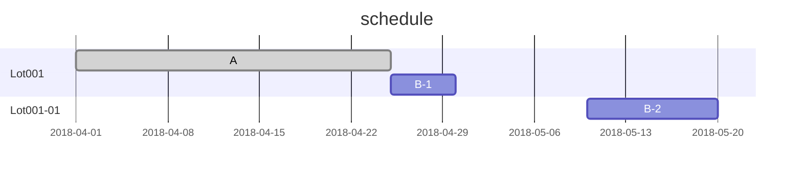

# WELCOME

## schedule



- 1st Lot is already up.
- I have to give instructions to the next process.

## Lot Summay

```wfmap
{
  "title" : "Wf01",
  "config" : {
    "wfsize" : 200,
    "offsetX" : 12.2,
    "offsetY" : 4.0,
    "chipSizeX" : 24.8,
    "chipSizeY" : 17.2,
    "countX" : 9,
    "countY" : 12,
    "edge" : 5,
    "notch" : 9,
    "notchside" : 0
  },
  "chip": [
    {"y" : 1, "x": 3, "text": 22},
    {"y" : 1, "x": 4, "text": 23},
    {"y" : 1, "x": 5, "text": 42, "background" : "black"},
    {"y" : 2, "x": 2, "text": 43},
    {"y" : 2, "x": 3, "text": 41},
    {"y" : 2, "x": 4, "text": 24},
    {"y" : 2, "x": 5, "text": 21},
    {"y" : 2, "x": 6, "text": 5},
    {"y" : 3, "x": 2, "text": 6},
    {"y" : 3, "x": 3, "text": 20},
    {"y" : 3, "x": 4, "text": 25},
    {"y" : 3, "x": 5, "text": 40},
    {"y" : 3, "x": 6, "text": 44},
    {"y" : 4, "x": 7, "text": 54},
    {"y" : 4, "x": 6, "text": 45},
    {"y" : 4, "x": 5, "text": 39}
  ]
}
```

## This document

This documentation is written in GitHub Flavored Markdown (GFM) expanded with mermaid and wfmapEditor.
